# Pusat Karir — Entity Relationship Diagram (ERD)

Database schema reference for the `pusatkarir-v1` Laravel application.
Derived from the migration files in `database/migrations/`.

> The Mermaid block below renders as an interactive ERD on GitHub, GitLab,
> VS Code (with a Mermaid extension), and most modern markdown viewers.

---

## 1. Visual ERD (Mermaid)

```mermaid
erDiagram
    %% ============ CORE USER ============
    users ||--o{ employer            : "has"
    users ||--o{ jobseeker           : "has"
    users ||--o{ pembayaran          : "pays"
    users ||--o{ notification        : "receives"
    users ||--o{ user_social_media   : "links"

    social_media ||--o{ user_social_media : "used in"

    %% ============ EMPLOYER ============
    industri_type ||--o{ employer    : "categorizes"
    employer      ||--o{ job         : "posts"
    employer      ||--o{ job_fair_job : "participates"

    %% ============ JOB ============
    job ||--o{ step                     : "has steps"
    job ||--o{ application              : "receives"
    job ||--o{ _kualifikasi_job         : "requires"
    job ||--o{ tugas_dan_tanggung_jawab : "defines"
    job ||--o{ job_fair_job             : "listed in"

    proses ||--o{ step                  : "classifies"
    step   ||--o{ progress              : "tracked in"

    %% ============ APPLICATION ============
    jobseeker     ||--o{ application    : "submits"
    application   ||--o{ progress       : "advances"

    %% ============ JOBSEEKER PROFILE ============
    jobseeker_type ||--o{ jobseeker          : "types"
    jobseeker      ||--o{ organisasi         : "has"
    jobseeker      ||--o{ bahasa             : "speaks"
    jobseeker      ||--o{ riwayat_kerja      : "has"
    jobseeker      ||--o{ prestasi           : "has"
    jobseeker      ||--o{ riwayat_pendidikan : "has"
    jobseeker      ||--o{ pelatihan          : "attends"
    jobseeker      ||--o{ rekomendasi        : "has"

    %% ============ MEMBERSHIP / PAYMENT ============
    membership ||--o{ pembayaran : "purchased as"
    account    ||--o{ pembayaran : "receives"

    %% ============ JOB FAIR ============
    job_fair ||--o{ job_fair_job : "contains"

    %% ============ ENTITY DEFINITIONS ============
    users {
        bigint   id PK
        string   first_name
        string   last_name
        string   email UK
        string   phone_number
        string   street_addr
        timestamp email_verified_at
        string   user_type
        string   password
        enum     status "pending|active|blocked|inactive"
        string   profile_image
        string   remember_token
        timestamps ts
    }

    social_media {
        bigint id PK
        string platform_social_media
        timestamps ts
    }

    user_social_media {
        bigint id PK
        bigint user_id FK
        bigint social_media_id FK
        string social_media_name
        timestamps ts
    }

    notification {
        bigint id PK
        bigint user_id FK
        string type
        string title
        text   message
        string link
        bool   is_read
        timestamps ts
    }

    industri_type {
        bigint id PK
        string nama_industri
        timestamps ts
    }

    employer {
        bigint id PK
        bigint user_id FK
        bigint industriType_id FK
        string nama_perusahaan
        text   deskripsi_perusahaan
        string alamat_perusahaan
        string telp_perusahaan
        string website
        timestamps ts
    }

    posisi {
        bigint id PK
        string nama_posisi
        timestamps ts
    }

    job {
        bigint id PK
        bigint employer_id FK
        string nama_pekerjaan
        string posisi
        text   requirement
        string deskripsi_pekerjaan
        string alamat
        string ekspektasi_gaji
        string worktime
        date   application_deadline
        timestamps ts
    }

    _kualifikasi_job {
        bigint id PK
        bigint job_id FK
        string kualifikasi
        timestamps ts
    }

    tugas_dan_tanggung_jawab {
        bigint id PK
        bigint job_id FK
        string tugas
        timestamps ts
    }

    proses {
        bigint id PK
        string nama_proses
        timestamps ts
    }

    step {
        bigint  id PK
        bigint  job_id FK
        bigint  proses_id FK
        uint    urutan
        text    deskripsi
        timestamps ts
    }

    jobseeker_type {
        bigint id PK
        string jobseekerType
        timestamps ts
    }

    jobseeker {
        bigint id PK
        bigint user_id FK
        bigint jobseeker_type_id FK
        string first_name
        string last_name
        string jenis_kelamin
        date   ttl
        timestamps ts
    }

    application {
        bigint id PK
        bigint jobseeker_id FK
        bigint job_id FK
        date   tanggal_apply
        enum   status "pending|accepted|rejected"
        timestamps ts
    }

    progress {
        bigint id PK
        bigint application_id FK
        bigint step_id FK
        text   catatan
        bool   lulus
        timestamps ts
    }

    organisasi {
        bigint id PK
        bigint jobseeker_id FK
        string nama_organisasi
        string jabatan
        text   keterangan
        timestamps ts
    }

    bahasa {
        bigint id PK
        bigint jobseeker_id FK
        string bahasa
        text   keterangan
        timestamps ts
    }

    riwayat_kerja {
        bigint id PK
        bigint jobseeker_id FK
        text   keterangan
        timestamps ts
    }

    prestasi {
        bigint id PK
        bigint jobseeker_id FK
        string nama_penghargaan
        string tahun
        string dokumen
        timestamps ts
    }

    riwayat_pendidikan {
        bigint id PK
        bigint jobseeker_id FK
        string jenjang
        string instansi
        string indeks_nilai
        text   keterangan
        timestamps ts
    }

    pelatihan {
        bigint id PK
        bigint jobseeker_id FK
        string nama_pelatihan
        string tahun
        string sertifikat
        timestamps ts
    }

    rekomendasi {
        bigint id PK
        bigint jobseeker_id FK
        string nama_perekomendasi
        string posisi
        string no_hp
        string alamat
        timestamps ts
    }

    membership {
        bigint id PK
        string nama_membership
        string durasi
        string harga
        timestamps ts
    }

    account {
        bigint nomor_rekening PK
        string nama_bank
        string atas_nama
        timestamps ts
    }

    pembayaran {
        bigint id PK
        bigint user_id FK
        bigint membership_id FK
        bigint nomor_rekening FK
        date   tgl_mulai
        date   tgl_berakhir
        timestamps ts
    }

    job_fair {
        bigint id PK
        string nama
        text   deskripsi
        string lokasi
        date   tanggal_mulai
        date   tanggal_selesai
        enum   status "draft|active|completed"
        timestamps ts
    }

    job_fair_job {
        bigint id PK
        bigint job_fair_id FK
        bigint job_id FK
        bigint employer_id FK
        enum   status "pending|approved|rejected"
        timestamps ts
    }
```

---

## 2. Domain Groupings

### 2.1 Core User & Access
| Table | Role |
|---|---|
| `users` | Base account for admin / jobseeker / employer (polymorphic via `user_type`) |
| `social_media` | Lookup of platform names (Facebook, LinkedIn, …) |
| `user_social_media` | Pivot: per-user profile links |
| `notification` | In-app notifications (`type`, `is_read`, optional `link`) |

### 2.2 Employer
| Table | Role |
|---|---|
| `industri_type` | Industry category master |
| `employer` | Company profile (1-to-1 with a `users` row of type employer) |

### 2.3 Job & Recruitment Pipeline
| Table | Role |
|---|---|
| `job` | Job posting |
| `_kualifikasi_job` | Repeatable qualification bullets per job |
| `tugas_dan_tanggung_jawab` | Repeatable duties per job |
| `proses` | Master list of pipeline-stage *types* (interview, test, …) |
| `step` | Ordered stages (`urutan`) for a specific job, referencing a `proses` |
| `application` | One jobseeker applying to one job (`status` enum) |
| `progress` | Per-step result for an application (`lulus`, `catatan`) |

### 2.4 Jobseeker Profile
| Table | Role |
|---|---|
| `jobseeker_type` | Classification (alumni, student, external…) |
| `jobseeker` | Seeker profile (1-to-1 with a `users` row) |
| `organisasi` | Organisational experience |
| `bahasa` | Languages |
| `riwayat_kerja` | Work history |
| `prestasi` | Achievements / awards |
| `riwayat_pendidikan` | Education history |
| `pelatihan` | Training / certifications |
| `rekomendasi` | References |

### 2.5 Membership & Payment
| Table | Role |
|---|---|
| `membership` | Plan catalogue (name, duration, price) |
| `account` | Receiving bank accounts (PK = `nomor_rekening`) |
| `pembayaran` | Payment record linking `users`, `membership`, `account` |

### 2.6 Job Fair
| Table | Role |
|---|---|
| `job_fair` | Event (`draft` / `active` / `completed`) |
| `job_fair_job` | Pivot: job submitted by employer to a fair, with approval `status`. Unique on `(job_fair_id, job_id)` |

### 2.7 Framework / Support Tables
| Table | Role |
|---|---|
| `password_resets` | Laravel auth reset tokens |
| `failed_jobs` | Laravel queue failures |
| `media` | Spatie MediaLibrary attachments (polymorphic) |
| `permissions`, `roles`, `model_has_permissions`, `model_has_roles`, `role_has_permissions` | Spatie Permission RBAC |
| `posisi` | Reference table of positions — **currently unused** (the `job.posisi` FK is commented out; the column is a plain string) |

---

## 3. Relationship Summary

| Parent | Child | Cardinality |
|---|---|---|
| `users` | `employer`, `jobseeker`, `pembayaran`, `notification`, `user_social_media` | 1..N |
| `social_media` | `user_social_media` | 1..N |
| `industri_type` | `employer` | 1..N |
| `employer` | `job`, `job_fair_job` | 1..N |
| `job` | `step`, `application`, `_kualifikasi_job`, `tugas_dan_tanggung_jawab`, `job_fair_job` | 1..N |
| `proses` | `step` | 1..N |
| `step` | `progress` | 1..N |
| `jobseeker_type` | `jobseeker` | 1..N |
| `jobseeker` | `application`, `organisasi`, `bahasa`, `riwayat_kerja`, `prestasi`, `riwayat_pendidikan`, `pelatihan`, `rekomendasi` | 1..N |
| `application` | `progress` | 1..N |
| `membership` | `pembayaran` | 1..N |
| `account` | `pembayaran` | 1..N |
| `job_fair` | `job_fair_job` | 1..N |

---

## 4. Design Notes

- **Three root actors** all hang off `users`: admin (distinguished by `user_type`), `employer.user_id`, and `jobseeker.user_id`. No separate auth tables.
- **Recruitment pipeline** is modeled as `job → step (ordered by urutan) ← progress → application`, so each job defines its own recruitment stages.
- **Job fair** is an optional overlay — a job posting exists independently and may be cross-listed to fairs via `job_fair_job`.
- **Status enums**: `users.status`, `application.status`, `job_fair.status`, `job_fair_job.status`. All use Laravel enum columns.
- **Naming is singular** for most tables (`job`, `employer`, `application`) — Laravel's default pluralization is overridden at the model level.
- **`account.nomor_rekening`** is the primary key (not `id`) — referenced by `pembayaran.nomor_rekening`.
- **Performance indexes** were added in `2026_04_12_120000_add_performance_indexes.php`; `notification` additionally indexes `(user_id, is_read)` for unread-count queries.
